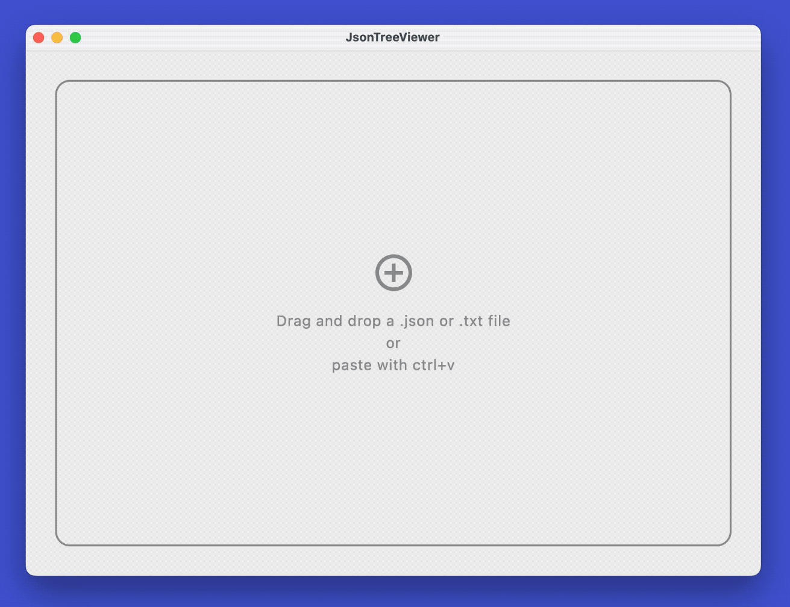

# JsonTreeViewer


<br /><br />
JsonTreeViewer is a Compose Multiplatform desktop app to display JSON data. It's based on the library [JsonTree](https://github.com/snappdevelopment/JsonTree).
<br /><br />



## About

JsonTreeViewer is an Compose Multiplatform desktop app to display formatted JSON data.

The tree can be expanded and collapsed and show additional metadata like array indices and item counts in arrays and object. By using the search field, the tree can be search for keys and values. The info panel shows data about the json file itself.

Files with the extension `.json` and `.txt` can be opened via drag and drop, or data can be pasted directly with `ctrl+v` or `cmd+v`.

## Download

JsonTreeViewer runs on MacOS, Windows and Linux using the JVM.

Get the latest binary from the [releases page](https://github.com/snappdevelopment/JsonTreeViewer/releases) or build from source by running:
```
./gradlew :composeApp:packageDistributionForCurrentOS
```

## License

```
JsonTreeViewer
Copyright © 2025 SNAD

Licensed under the Apache License, Version 2.0 (the "License");
you may not use this file except in compliance with the License.
You may obtain a copy of the License at

http://www.apache.org/licenses/LICENSE-2.0

Unless required by applicable law or agreed to in writing, software
distributed under the License is distributed on an "AS IS" BASIS,
WITHOUT WARRANTIES OR CONDITIONS OF ANY KIND, either express or implied.
See the License for the specific language governing permissions and 
limitations under the License.
```
See [LICENSE](LICENSE.md) to read the full text.
